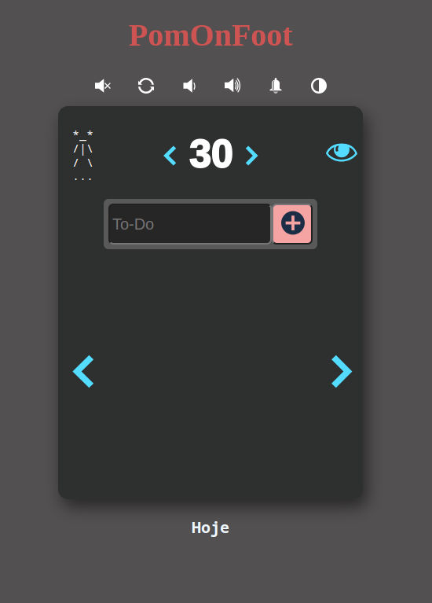

# PomOnFoot

Pomodoro App thought and developed on graduation period.

The idea came in APS class (System Analysis and Design), and then I started to model it on Figma.

The meaning of PomOnFoot came from a series of mark from Pedrobolfute,
where we have Pedrobolfute > PedrOnFoot > DiariOnFoot > WeOnFoot > PomOnFoot.

Meaning some things:

- **OnFoot** : process of walk; that means to walk one step at a time without stop

- **...** : means that it didn't ended yet

I started to develop it on WEB 1 class (Programation for Web).
When the project development started I called two frinds mine to help.

- [Deivisson](https://github.com/Deivissonxavier)
- [Neandro](https://github.com/Neandro-Silva)

This project was developed in pure HTML, CSS and JavaScript.

- Give a look: https://pedrobolfute.github.io/PomOnFoot/

Animation/Gif:

## Where to find OnFoots

[Pedrobolfute](https://github.com/Pedrobolfute): GitHub and Social Networks

[DiariOnFoot](https://www.diarionfoot.com/): Site/Blog that is a diare from a TI Student

[WeOnFoot](https://discord.com/invite/KU4YNdBBv6): Study with me on Discord Server

[PomOnFoot](https://pedrobolfute.github.io/PomOnFoot/): Pomodoro App
